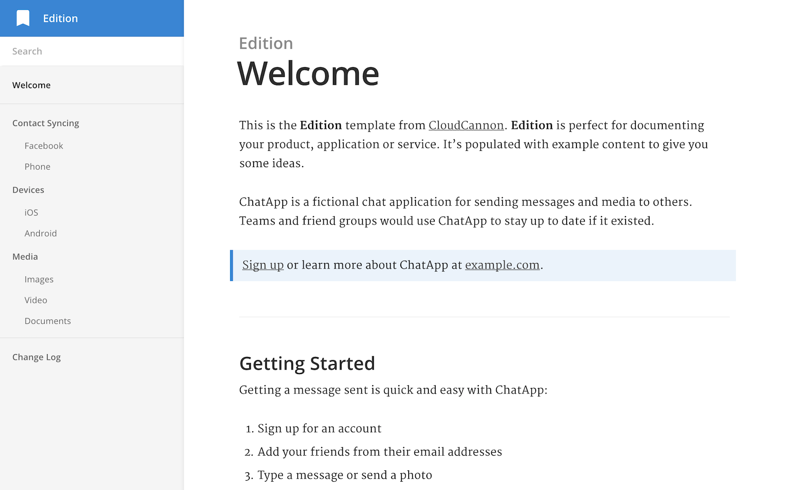

# Edition [ LEGACY TEMPLATE NO LONGER MAINTAINED ]

<<<<<<< HEAD

=======
Product documentation template for Jekyll. Browse through a [live demo](https://long-pig.cloudvent.net/).
Start documenting your product, application, service or website with this configurable theme.

>>>>>>> 9863b0873c1ad832e67c0110d2c9f3210add3968

Edition was made by [CloudCannon](http://cloudcannon.com/), the Cloud CMS for Jekyll.

<<<<<<< HEAD
- [Introduction](#introduction)
  - [What is EmComm?](#what-is-emcomm)
  - [Why do we need EmComm?](#why-do-we-need-emcomm)
  - [Who may need our assistance](#who-may-need-our-assistance)
- [Security Considerations](#security-considerations)
- [Information is King](#information-is-king)
- [VK6DEV Comm Plan](#vk6dev-comm-plan)
- [Training](#training)
- [Tools](#tools)
- [Resources](#resources)
  - [Software Projects](#software-projects)
- [Reference Resources](#reference-resources)
  - [Emergency Services Radio](#emergency-services-radio)
  - [Martime Radio](#martime-radio)
  - [Citizens Band (CB) Radio](#citizens-band-cb-radio)
  - [AusTavel Safety Net](#austavel-safety-net)
  - [Useful Amateur Radio Frequencies](#useful-amateur-radio-frequencies)
  - [Band Plans](#band-plans)
  - [Emergency Management Agencies (Australia)](#emergency-management-agencies-australia)
- [Amatuer Radio Emergency Beacon Project](#amatuer-radio-emergency-beacon-project)
- [Useful Information during EmComm Event](#useful-information-during-emcomm-event)
=======
Find more templates, themes and step-by-step Jekyll tutorials at [CloudCannon Academy](https://learn.cloudcannon.com/).
>>>>>>> 9863b0873c1ad832e67c0110d2c9f3210add3968

## Features

<<<<<<< HEAD
This is a living document, it will change and grow over time so make sure you
come back regularly.
=======
* Two column layout
* Full text search
* Pre-styled components
* Auto-generated navigation based on category
* Optimised for editing in [CloudCannon](http://cloudcannon.com/)
* Change log
* RSS/Atom feed
* SEO tags
* Google Analytics
>>>>>>> 9863b0873c1ad832e67c0110d2c9f3210add3968

## Setup

1. Add your site and author details in `_config.yml`.
2. Get a workflow going to see your site's output (with [CloudCannon](https://app.cloudcannon.com/) or Jekyll locally).

## Develop

Edition was built with [Jekyll](http://jekyllrb.com/) version 3.3.1, but should support newer versions as well.

Install the dependencies with [Bundler](http://bundler.io/):

~~~bash
$ bundle install
~~~

Run `jekyll` commands through Bundler to ensure you're using the right versions:

~~~bash
$ bundle exec jekyll serve
~~~

## Editing

Edition is already optimised for adding, updating and removing documentation pages in CloudCannon.

### Documentation pages

* Add, update or remove a documentation page in the *Documentation* collection.
* Change the category of a documentation page to move it to another section in the navigation.
* Documentation pages are organised in the navigation by category, with URLs based on the path inside the `_docs` folder.

### Change log

* Add, update or remove change log entries from your posts.
* Tag entries as minor or major in the front matter.

### Search

* Add `excluded_in_search: true` to any documentation page's front matter to exclude that page in the search results.

### Navigation

<<<<<<< HEAD
To gather information you can:

- Listen to official radio sources
- listen to broadcast radio
- read official govt information
- read/listen/watch media reports
- listen to your local amateur radio news

A central location for verified information is important. From this central location
others should be able retieve the information.

## VK6DEV Comm Plan

Having a plan is important.  

[My Comms Plan](./commsPlan.md)

## Training

Like everything we do in life, **practice makes perfect**
Having a methodology for emergency communications is no good is you don’t know
it works.
If nobody knows how to use it, how will they know how to do it when it’s really needed.

- drills
- nets

## Tools

- Analogue Voice
- Digital Voice
- [APRS](./APRS.MD)
- APRS Messaging
- [Winlink email](./Winlink.md)
- JS8Call
- VaraAC
- AREDN
- email
- [aprsd](./aprsd.md)
- [Paging](./pagers.md)

**TODO:**  "How to" page for basic operation of each tool.

## Resources

A list of resources usefull when developing an EmComm strategy.

### Software Projects

- Digipi
- EmCommTools

## Reference Resources

Below is some reference material collected from various sources.

**TODO:** Document BOM weather radio and weather fax freuqncies and procedures.

**TODO:** Find some information regarding WAPOL radio networks for reference.

**TODO:** SES radio resources??

### Emergency Services Radio

The Emergency Services in Western Australia operate several command and control
radio networks. The WA Police operate a secure encrypted voice and data network.

I have little information about St John Ambulance.  
DEFS runs the WAERN mostly on FM.  
DPAW uses VHF FM.

The following frequency lists were found on the internet. The information was
dated 2016 which make it significantly old. I have included the original source
PDF but have also included a document which indicates if I have confirmed the
frequency.

[WAERN Frequency List (Markdown)](./ESR.md)  
[WAERN Frequency List (PDF)](./Resources/WARSUG-WAERN-freqs.pdf)  
[WAERN Channel (Chirp Import CSV)](./Resources/WAERN-FREQ-IMPORT-CHIRP.csv)

[St John's Smbulance Radio Freq (WA)](./Resources/sjawa.pdf)

### Martime Radio

Check out the Maritime Radio page [here.](./maritime-Radio.md)

### Citizens Band (CB) Radio

Citizens Band Radio in Australia operates under the Citizend Band radios
stations class license. The regulations regarding CB radio can be found in the
Radiocommunications Act 1992 and the Citizens Band Radio Stations Class License
2015 and their various ammendments.

These documents are available from [The ACMA Wesbite](http://www.legislation.gov.au/Series/F2015L00876)

[CB Radio Page](./CB-Radio.md)

### AusTavel Safety Net

**TODO:** Add austravel details and frequencies

### Useful Amateur Radio Frequencies

| Frequency | Description |
|---|---|
| 146.500 | 2m Calling Frequency |
| 145.175 | Primary APRS Frequency |

### Band Plans

| Frequencies | Description |
| --- | --- |
| 26.965 - 27.405 | CB Radio HF |
| 144.000 - 148.000 | Amateur Radio 2m Band |
| 156.000 - 162.050 | Marine Radio VHF Band |
| 430.000 - 450.000 | Amateur Radio 70cm Band |
| 476.425 - 477.4125 | CB Radio UHF |

### Emergency Management Agencies (Australia)

- Federal Govt.
  - [National Emergency Management Agency](https://nema.gov.au/#/map)
  - [Home Affairs](https://www.homeaffairs.gov.au/about-us/our-portfolios/emergency-management)
  - [Australian Disaster Resilience Knowledge Hub](https://knowledge.aidr.org.au)
- Western Australia Govt.
  - [Emergency WA](https://www.emergency.wa.gov.au)
  - [State Emergency Management Committee](https://www.wa.gov.au/organisation/state-emergency-management-committee)
  - [WALGA Emergency Management](https://walga.asn.au/policy-and-advocacy/our-policy-areas/emergency-management)
  - [SES Cummunications Support Unit](https://csu-ses.com.au)
  - [Dept of Fire & Emergency Services](https://www.dfes.wa.gov.au)
  
## Amatuer Radio Emergency Beacon Project

Lets design an information, gathering, storing and deceminating system.

Check out the [design and specifications](./AREIB/AREIB.md)

## Useful Information during EmComm Event

- Road Conditions
  - Road Closures
- Utilities
  - Electricity
  - Water
  - Internet
  - Mobile Telephones
- Services Status
  - Hospital
  - Ambulance Service
  - Fire Service
  - Schools
  - Evacuation Centres
  
=======
* Change `site.show_full_navigation` to control all or only the current navigation group being open.
>>>>>>> 9863b0873c1ad832e67c0110d2c9f3210add3968
